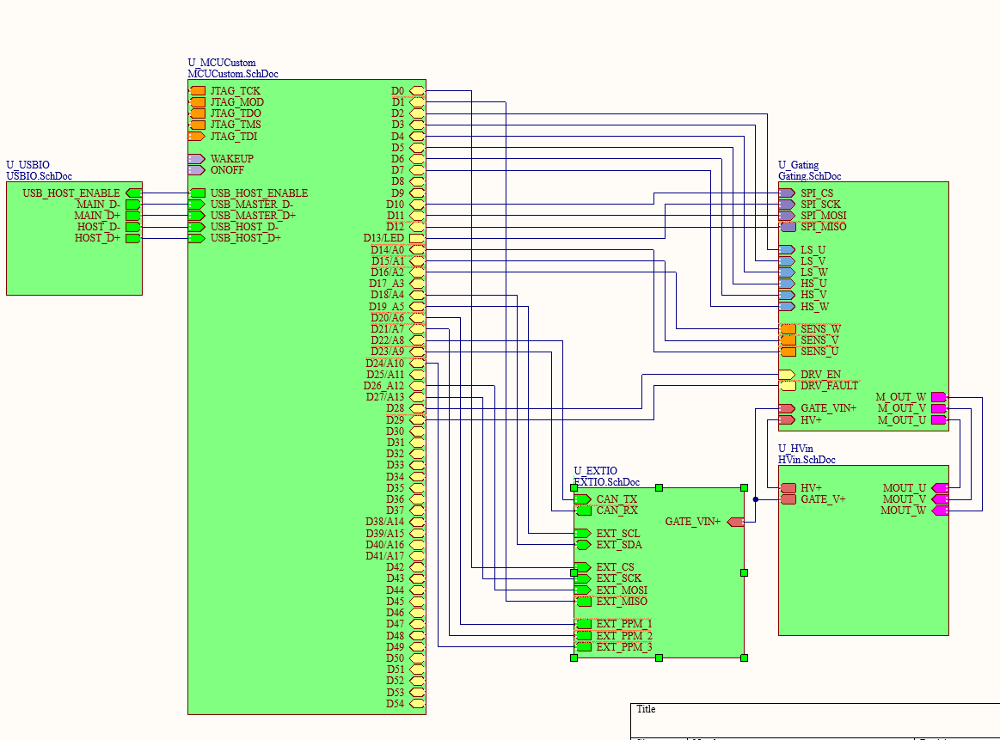
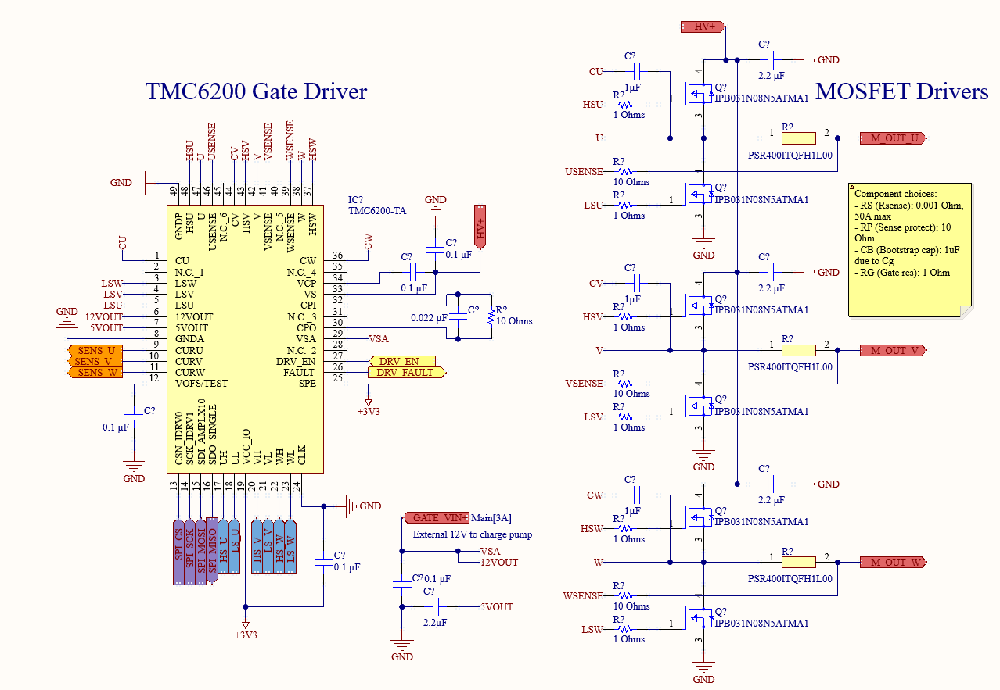
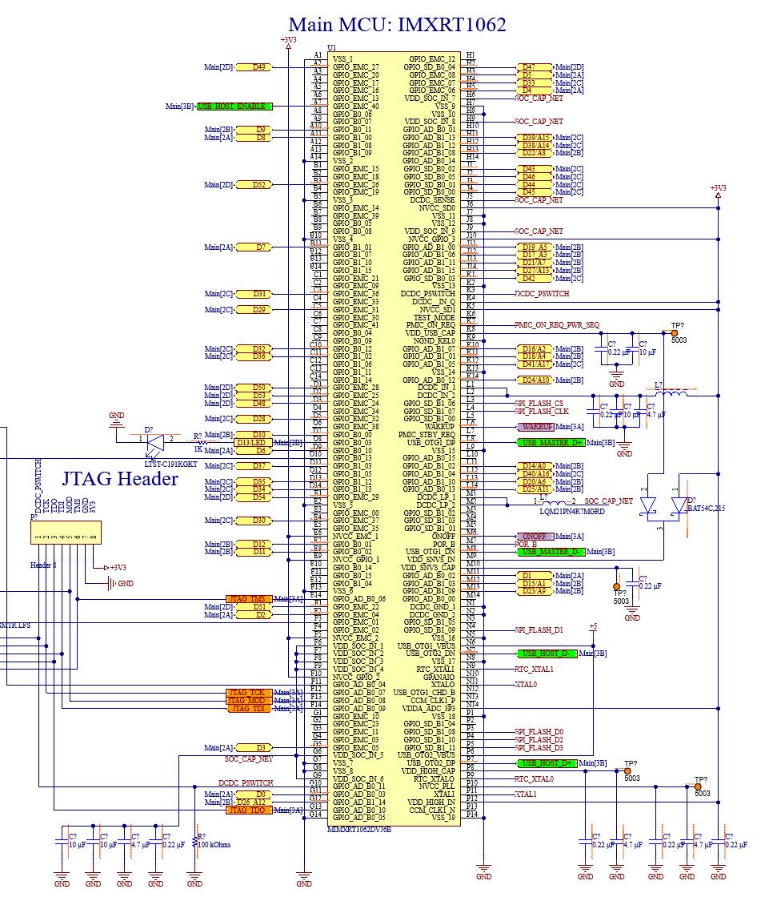
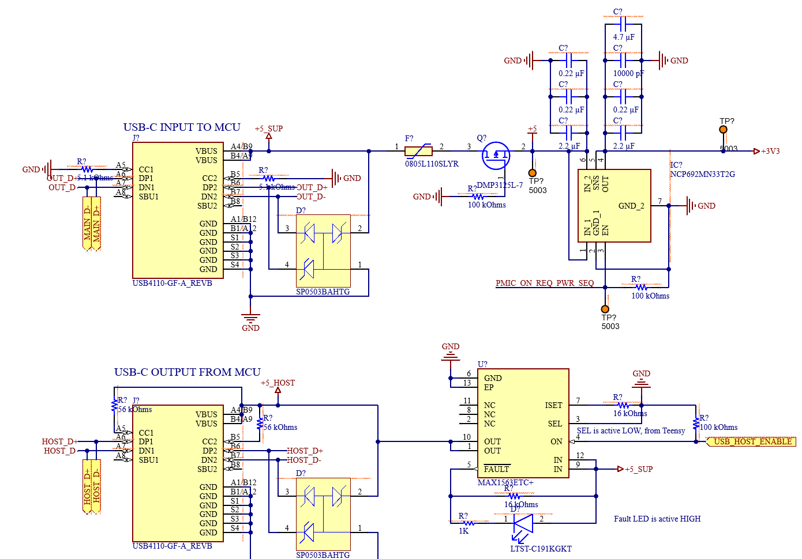

# MotorControl
 Custom brushless motor controller based around the Teensy 4.1 and TMC6200 gate driver chip.
 Designed for EC.S02, an IAP PCB Design Class at MIT, with Altium Designer

# Screenshots!

The layout is unfinished at this time, but there are some cool schematic screenshots to share:

### High-Level schematic:

### Gate drivers:

### IMXRT1062JV6B:

### USB input schematic:

# Helpful reference material

- This repo: [Teensy 4.1 example](https://github.com/jenschr/Teensy-4.1-example)
- [PJRC's website](https://pjrc.com)